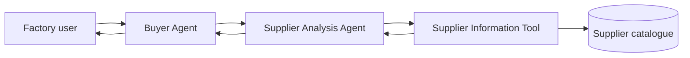
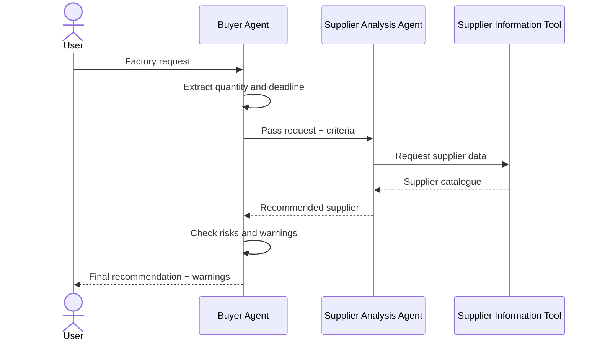

# UML Diagrams

## Use case diagram

```mermaid
flowchart LR
    User[Factory user]
    Buyer[Buyer Agent]
    Analysis[Supplier Analysis Agent]
    Tool[Supplier Information Tool]
    Catalog[(Supplier catalogue)]

    User --> Buyer
    Buyer --> Analysis
    Analysis --> Tool
    Tool --> Catalog
    Tool --> Analysis
    Analysis --> Buyer
    Buyer --> User
```

## Sequence diagram

```mermaid
sequenceDiagram
    actor User
    participant Buyer as Buyer Agent
    participant Analysis as Supplier Analysis Agent
    participant Tool as Supplier Information Tool

    User->>Buyer: Factory request
    Buyer->>Buyer: Extract quantity and deadline
    Buyer->>Analysis: Pass request + criteria
    Analysis->>Tool: Request supplier data
    Tool-->>Analysis: Supplier catalogue
    Analysis-->>Buyer: Recommended supplier
    Buyer->>Buyer: Check risks and warnings
    Buyer-->>User: Final recommendation + warnings
```
